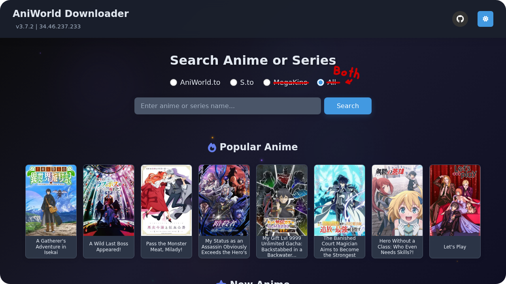

<a id="readme-top"></a>
# AniWorld Downloader

AniWorld Downloader is a tool for downloading content from various streaming sites. It features a modern web interface and can be easily deployed using Docker.




<p align="right">(<a href="#readme-top">back to top</a>)</p>

## Core Features

- **Web Interface**: A modern web UI for easy searching, downloading, and queue management with real-time progress tracking.
- **Docker Support**: Containerized deployment with Docker and Docker Compose for a quick and easy setup.
- **Download Queue**: Manage all your downloads in one place with a clear and organized queue.
- **Multiple Sources**: Download content from a variety of sources.
- **Custom Download Paths**: Set different download directories for series/anime and movies to keep your library organized.

<p align="right">(<a href="#readme-top">back to top</a>)</p>

## Supported Sites

You can download content from the following websites:

- **AniWorld.to** (Anime)
- **S.to** (Anime & Series)
- **MegaKino.ms** (Movies)

<p align="right">(<a href="#readme-top">back to top</a>)</p>

## Supported Hosters

The downloader supports a wide range of popular hosters, including:
- VOE
- Filemoon
- Vidmoly
- Doodstream
- Streamtape
- and more...

<p align="right">(<a href="#readme-top">back to top</a>)</p>

## Installation

### Prerequisites

Ensure you have **[Python 3.9](https://www.python.org/downloads/)** or higher installed.<br>
Additionally, make sure **[Git](https://git-scm.com/downloads)** is installed if you plan to install the development version.

### Installation

#### Install Latest Stable Release (Recommended)

To install the latest stable version, use the following command:

```shell
pip install --upgrade aniworld
```

#### Install Latest Development Version (Requires Git)

To install the latest development version directly from GitHub, use the following command:

```shell
pip install --upgrade git+https://github.com/Yezun-hikari/AniWorld-Downloader.git@next#egg=aniworld
```

<p align="right">(<a href="#readme-top">back to top</a>)</p>

## Usage

The primary way to use this tool is through its web interface, especially when deployed with Docker.

### Web Interface

Launch the modern web interface for easy searching, downloading, and queue management:

```shell
aniworld --web-ui
```

The web interface provides:
- **Modern Search**: Search for anime, series, and movies across all supported sites.
- **Episode/Movie Selection**: A visual picker to select what you want to download.
- **Download Queue**: Track the real-time progress of all your downloads.
- **User Authentication**: Optional multi-user support with admin controls.
- **Settings Management**: Configure providers, languages, and download preferences.

#### Web Interface Options

```shell
# Basic web interface (localhost only)
aniworld --web-ui

# Expose to network (accessible from other devices)
aniworld --web-ui --web-expose

# Enable authentication for multi-user support
aniworld --web-ui --enable-web-auth

# Set custom download paths
aniworld --web-ui --output-dir /path/to/series-downloads --movie-dir /path/to/movie-downloads
```

<p align="right">(<a href="#readme-top">back to top</a>)</p>

## Docker Deployment

The recommended way to run the AniWorld Downloader is with Docker, which simplifies setup and dependency management.

### Using Docker Compose (Recommended)

1. Clone the repository:
   ```shell
   git clone https://github.com/Yezun-hikari/AniWorld-Downloader.git
   cd AniWorld-Downloader
   ```

2.  Modify `docker-compose.yml` to set your download paths. By default, it will create `downloads` and `movies` directories in the project folder.

3. Build and start the container:
   ```shell
   docker-compose up -d --build
   ```

### Docker Configuration

The Docker container runs with:
- **User Security**: Non-root user for enhanced security.
- **System Dependencies**: Includes ffmpeg for video processing.
- **Web Interface**: Enabled by default with authentication and network exposure.
- **Download Directories**:
    - `/app/downloads` (for series/anime)
    - `/app/movies` (for movies)
- **Port**: 8080 (configurable via environment variables)

<p align="right">(<a href="#readme-top">back to top</a>)</p>

## Support

If you need help with AniWorld Downloader, you can:

- **Submit an issue** on the [GitHub Issues](https://github.com/Yezun-hikari/AniWorld-Downloader/issues) page.

If you find this tool useful, consider starring the repository on GitHub. Your support is greatly appreciated!

Thank you for using AniWorld Downloader!

<p align="right">(<a href="#readme-top">back to top</a>)</p>

## Legal Disclaimer

This tool is made for accessing content that’s already publicly available online. It doesn’t support or promote piracy or copyright violations. The developer isn’t responsible for how the tool is used or for any content found through external links.

All content accessed with this tool is available on the internet, and the tool itself doesn’t host or share copyrighted files.

If you have concerns about any content accessed through this tool, please reach out directly to the website’s owner, admin, or hosting provider. Thanks for your understanding.

<p align="right">(<a href="#readme-top">back to top</a>)</p>

## License

This project is licensed under the **[MIT License](LICENSE)**.
For more details, see the LICENSE file.

<p align="right">(<a href="#readme-top">back to top</a>)</p>
